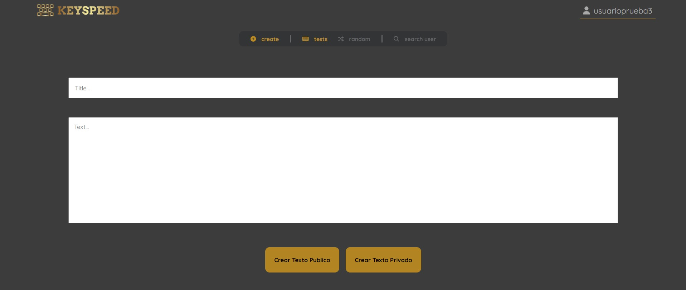
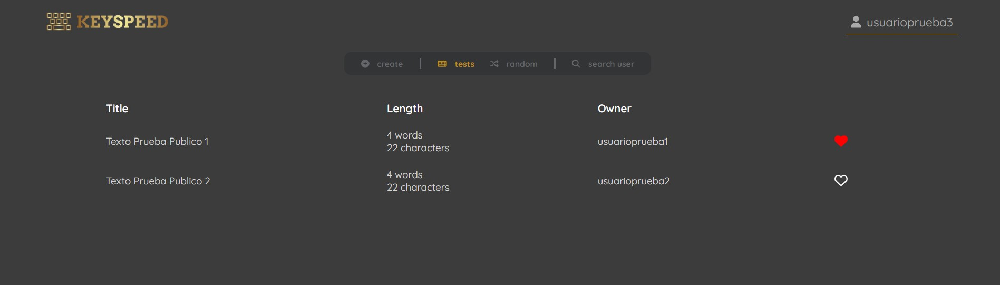
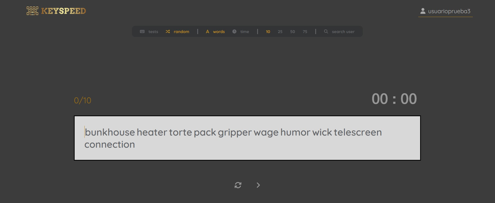
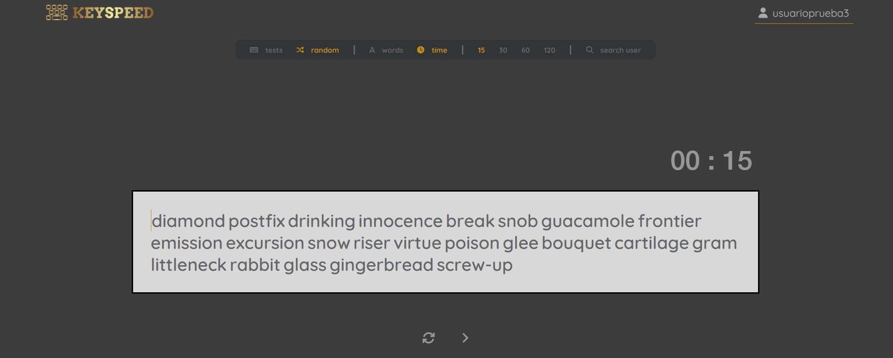
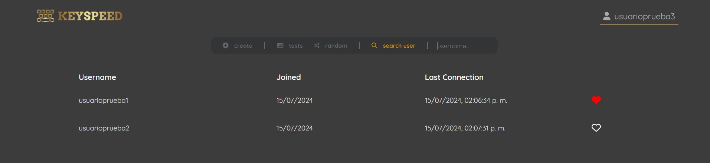
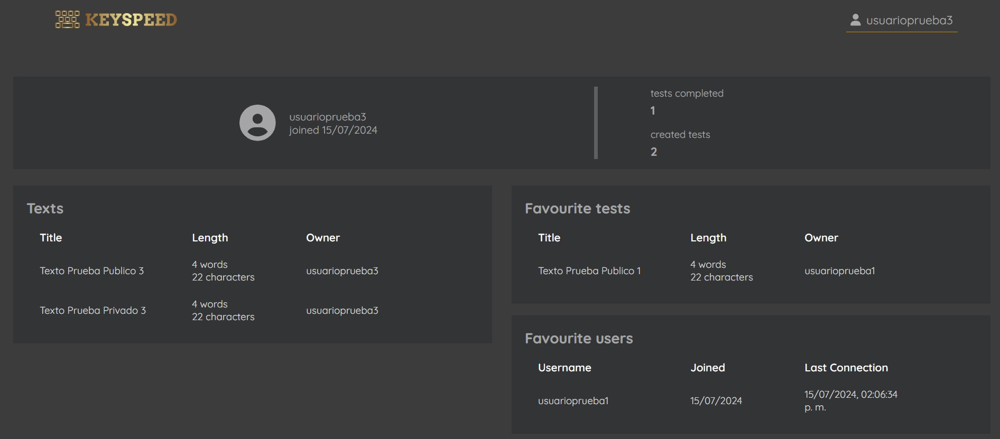

# ¿Alguna vez mediste tu velocidad al escribir con el tecaldo?

Con [***KEYSPEED***](https://keyspeed.netlify.app/) vas poder medir cuantas **Palabras Por Minuto (PPM)** podes escribir con diferentes **tests de mecanografía**. 

***¿Que estás esperando? Comenzá a practicar y mejorá tus skills con el teclado***.

## Tests

Al iniciar sesión en la sección de ***TESTS***, podes encontrar diefentes **textos creados por todos los usuarios** en la pagina. O podes crear el tuyo **publico o privado** en la sección ***CREATE***, para poder **practicar tus propios textos** y que mas **usuarios puedan completar tus tests**.

 

## Random tests

Además de textos creados por usuarios, podes practicar con **textos aleatorios** en el que vas a poder medir tus **PPM** con **diferentes modos**

### Palabras

Podes seleccionar la cantidad de palabras que tenga el texto. Vas a poder elegir desde **10, 25, 50 y 75 palabras**.

### Tiempo

Con un **temporizador en cuenta regresiva**, vas a poder elegir cuanto tiempo queres para escribir la mayor cantidad de palabras posibles. **15, 30, 60 y 120** son los **segundos** que podes seleccionar.

## Perfil

Desde le sección ***SEARCH USER***, va a ser posible encontrar el **perfil del usuario** que desees para poder ver sus **textos creados** además de sus **tests y usuarios favoritos**.

 

# TECNOLOGÍAS UTILIZADAS
- NODEJS
- MONGODB
- EXPRESSJS
- REACT VITE
- AXIOS
- JSONWEBTOKEN (JWT)
- CSS3
